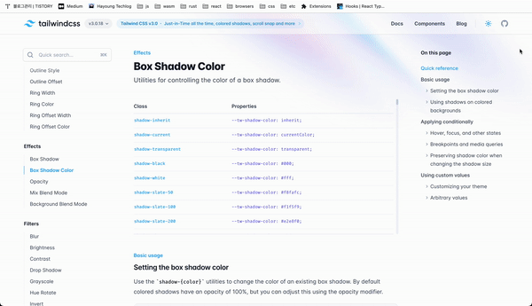
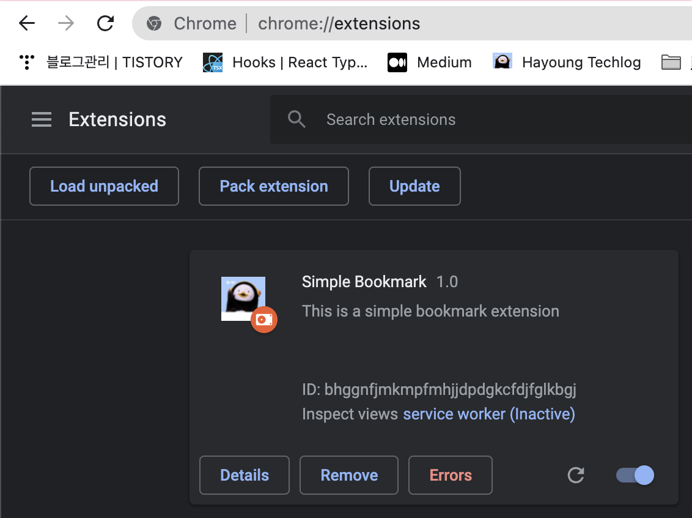

# Simple Bookmark Extension

It is a really simple bookmark chrome extension app to figure out how to develop
chrome extensions. Chrome Extensions are made of three parts - background
script, content script, and options page. My work is mostly focused on
background script and content script.



## Stack

- React
- TailwindCSS
- Lerna
- Typescript
- Parcel

## Structure

### background script

I took an object-oriented approach to handle the background script. When it
receives CRUD requests on bookmarks or iframe events, it processes those events.

### content script

I used an iframe element to inject my script into any web page. It uses React,
Tailwind.

### Common

I added shared constants and interfaces in this package.

## My blog posts

- [Using Lerna to manage my project in a Mono Repo way](https://hayoung-techlog.com/using-lerna-to-manage-my-project-in-a-mono-repo-way)
- [Using iframe with React Portal to isolate my component](https://hayoung-techlog.com/using-iframe-with-react-portal-to-isolate-my-component)
- [Using iframe as a root of my React App with createPortal and functional components](https://hayoung-techlog.com/using-iframe-as-a-root-of-my-react-app-with-createportal-and-functional-components)
- [How to retrieve favicon of websites(easiest way)](https://hayoung-techlog.com/how-to-retrieve-favicon-of-websiteseasiest-way)
- [Using React Context to remove prop drilling](https://hayoung-techlog.com/using-react-context-to-remove-prop-drilling)
- [How I used Tailwind CSS transition](https://hayoung-techlog.com/how-i-used-tailwind-css-transition)

## How to run

```
git clone https://github.com/hayoung0Lee/my-bookmark.git
npm install -g lerna
yarn boostrap
yarn start # start in dev mode

# go to chrome://extension
# Load unpacked
```


